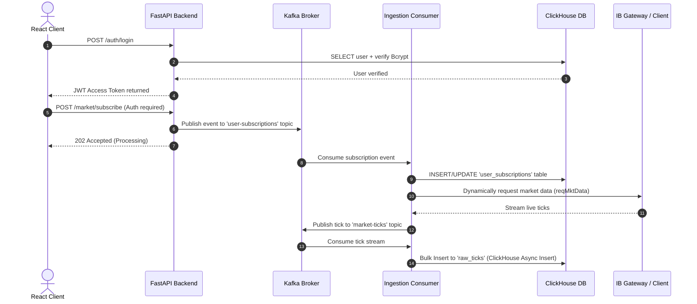

# US Market Architecture: ClickHouse, Kafka, Auth, & Subscription Pipeline

This document details the complete database schema, message queue architecture, and implementation blueprint for building a high-throughput, event-driven US Market trading analytics platform. 

The pipeline handles:
1. **User Authentication & Session Management** (FastAPI, JWT, Bcrypt, ClickHouse).
2. **Instrument Subscription Management** (Kafka-driven subscription events, hot-reloading IB stream).
3. **Market Tick Stream Ingestion** (Interactive Brokers -> Kafka -> Bulk ClickHouse insertion).

---

## 1. System Architecture Diagram



---

## 2. ClickHouse Database Schema

ClickHouse serves as both the time-series tick database and the relational application database (using `ReplacingMergeTree` for upsert support).

```sql
CREATE DATABASE IF NOT EXISTS trade_analytics_us;

-- ────────────────────────────────────────────────────────
-- 1. Users Table (Bcrypt Hashed Auth Storage)
-- ────────────────────────────────────────────────────────
CREATE TABLE IF NOT EXISTS trade_analytics_us.users (
    id String DEFAULT toString(generateUUIDv4()),
    username String,
    password_hash String,
    is_active UInt8 DEFAULT 1,
    created_at DateTime64(3) DEFAULT now64(3)
) ENGINE = ReplacingMergeTree(created_at)
ORDER BY (username);

-- ────────────────────────────────────────────────────────
-- 2. Instruments Master (Interactive Brokers Qualified Contracts)
-- ────────────────────────────────────────────────────────
CREATE TABLE IF NOT EXISTS trade_analytics_us.instruments (
    con_id UInt32,                -- IB Contract ID
    symbol LowCardinality(String),-- Ticker (e.g. AAPL)
    exchange LowCardinality(String) DEFAULT 'SMART',
    sec_type LowCardinality(String) DEFAULT 'STK', -- STK, FUT, IND, CASH
    currency LowCardinality(String) DEFAULT 'USD',
    name String,
    is_active UInt8 DEFAULT 1,
    added_at DateTime64(3) DEFAULT now64(3)
) ENGINE = ReplacingMergeTree(added_at)
ORDER BY (con_id);

-- ────────────────────────────────────────────────────────
-- 3. User Subscriptions Table (Active lists per user)
-- ────────────────────────────────────────────────────────
CREATE TABLE IF NOT EXISTS trade_analytics_us.user_subscriptions (
    subscription_id String DEFAULT toString(generateUUIDv4()),
    user_id String,               -- Username or User UUID
    con_id UInt32,
    symbol LowCardinality(String),
    is_active UInt8 DEFAULT 1,     -- 1 = Subscribed, 0 = Unsubscribed
    updated_at DateTime64(3) DEFAULT now64(3)
) ENGINE = ReplacingMergeTree(updated_at)
ORDER BY (user_id, con_id);

-- ────────────────────────────────────────────────────────
-- 4. Raw Ticks Table (Time-Series Market Feed)
-- ────────────────────────────────────────────────────────
CREATE TABLE IF NOT EXISTS trade_analytics_us.raw_ticks (
    con_id UInt32,
    symbol LowCardinality(String),
    last_price Decimal64(4),
    volume UInt64,
    bid_price Decimal64(4) DEFAULT 0,
    bid_size UInt64 DEFAULT 0,
    ask_price Decimal64(4) DEFAULT 0,
    ask_size UInt64 DEFAULT 0,
    close_price Decimal64(4) DEFAULT 0,
    ts DateTime64(3) CODEC(DoubleDelta, LZ4)
) ENGINE = MergeTree()
PARTITION BY toYYYYMMDD(ts)
ORDER BY (con_id, ts)
SETTINGS index_granularity = 8192;
```

---

## 3. Kafka Core Configuration

### 3.1 Topics Schema
1. **`user-subscriptions`**:
   * **Key:** `user_id` (String)
   * **Value:** JSON payload capturing subscription change.
   * **Payload Schema:**
     ```json
     {
       "user_id": "user_123",
       "con_id": 3691937,
       "symbol": "AAPL",
       "action": "SUBSCRIBE", // or "UNSUBSCRIBE"
       "timestamp": "2026-06-08T14:41:00Z"
     }
     ```
2. **`market-ticks`**:
   * **Key:** `con_id` (String)
   * **Value:** JSON payload representing an event tick from IB.
   * **Payload Schema:**
     ```json
     {
       "con_id": 3691937,
       "symbol": "AAPL",
       "last_price": 241.50,
       "volume": 1420500,
       "bid_price": 241.48,
       "bid_size": 200,
       "ask_price": 241.52,
       "ask_size": 100,
       "close_price": 240.10,
       "ts": "2026-06-08T14:41:02.124Z"
     }
     ```

---

## 4. Backend Implementation Blueprints

### 4.1 Login & JWT Authentication System

Below is the code configuration for FastAPI. Users are authenticated against the ClickHouse table.

```python
# app/auth/jwt_handler.py
from datetime import datetime, timezone, timedelta
from typing import Optional
from jose import jwt, JWTError
import bcrypt

JWT_SECRET = "YOUR_SUPER_SECRET_KEY"
JWT_ALGORITHM = "HS256"
JWT_EXPIRY_HOURS = 24

def hash_password(password: str) -> str:
    salt = bcrypt.gensalt()
    return bcrypt.hashpw(password.encode('utf-8'), salt).decode('utf-8')

def verify_password(plain_password: str, hashed_password: str) -> bool:
    return bcrypt.checkpw(plain_password.encode('utf-8'), hashed_password.encode('utf-8'))

def create_access_token(data: dict, expires_delta: Optional[timedelta] = None) -> str:
    to_encode = data.copy()
    expire = datetime.now(timezone.utc) + (expires_delta or timedelta(hours=JWT_EXPIRY_HOURS))
    to_encode.update({"exp": expire})
    return jwt.encode(to_encode, JWT_SECRET, algorithm=JWT_ALGORITHM)

def decode_access_token(token: str) -> Optional[dict]:
    try:
        return jwt.decode(token, JWT_SECRET, algorithms=[JWT_ALGORITHM])
    except JWTError:
        return None
```

```python
# app/auth/router.py
from fastapi import APIRouter, Depends, HTTPException, status
from pydantic import BaseModel
import clickhouse_connect
from app.auth import jwt_handler

router = APIRouter(prefix="/auth", tags=["auth"])
ch_client = clickhouse_connect.get_client(host="clickhouse", port=8123, database="trade_analytics_us")

class AuthRequest(BaseModel):
    username: str
    password: str

@router.post("/register")
async def register(req: AuthRequest):
    # Check existing user
    existing = ch_client.query("SELECT username FROM users WHERE username = {u:String} LIMIT 1", parameters={"u": req.username})
    if existing.result_rows:
        raise HTTPException(status_code=400, detail="Username already exists")
    
    # Store user
    pwd_hash = jwt_handler.hash_password(req.password)
    ch_client.insert("users", [[req.username, pwd_hash]], column_names=["username", "password_hash"])
    
    token = jwt_handler.create_access_token({"sub": req.username})
    return {"access_token": token, "token_type": "bearer"}

@router.post("/login")
async def login(req: AuthRequest):
    res = ch_client.query("SELECT username, password_hash FROM users WHERE username = {u:String} LIMIT 1", parameters={"u": req.username})
    if not res.result_rows:
        raise HTTPException(status_code=401, detail="Invalid credentials")
    
    user = res.result_rows[0]
    if not jwt_handler.verify_password(req.password, user[1]):
        raise HTTPException(status_code=401, detail="Invalid credentials")
    
    token = jwt_handler.create_access_token({"sub": req.username})
    return {"access_token": token, "token_type": "bearer"}
```

---

### 4.2 Instrument Subscription Router (FastAPI -> Kafka)

Instead of saving to the database synchronously, the API routes all client subscription requests directly to Kafka to ensure scaling capability and decoupled notification of the Interactive Brokers connector.

```python
# app/market/router.py
from fastapi import APIRouter, Depends, HTTPException
from pydantic import BaseModel
from confluent_kafka import Producer
import json
from datetime import datetime, timezone
from app.dependencies import get_current_user # Extracts user from JWT payload

router = APIRouter(prefix="/market", tags=["market"])

# Initialize Kafka producer
kafka_producer = Producer({
    'bootstrap.servers': 'kafka:9092',
    'acks': 'all'
})

class SubscriptionPayload(BaseModel):
    con_id: int
    symbol: str

def delivery_report(err, msg):
    if err:
        print(f"❌ Kafka delivery failed: {err}")

@router.post("/subscribe")
async def subscribe(payload: SubscriptionPayload, user: dict = Depends(get_current_user)):
    username = user["sub"]
    
    event = {
        "user_id": username,
        "con_id": payload.con_id,
        "symbol": payload.symbol.upper(),
        "action": "SUBSCRIBE",
        "timestamp": datetime.now(timezone.utc).isoformat()
    }
    
    # Push event to Kafka
    kafka_producer.produce(
        topic="user-subscriptions",
        key=username.encode('utf-8'),
        value=json.dumps(event).encode('utf-8'),
        callback=delivery_report
    )
    kafka_producer.poll(0)
    
    return {"status": "accepted", "message": f"Subscription request for {payload.symbol} queued"}

@router.post("/unsubscribe")
async def unsubscribe(payload: SubscriptionPayload, user: dict = Depends(get_current_user)):
    username = user["sub"]
    
    event = {
        "user_id": username,
        "con_id": payload.con_id,
        "symbol": payload.symbol.upper(),
        "action": "UNSUBSCRIBE",
        "timestamp": datetime.now(timezone.utc).isoformat()
    }
    
    kafka_producer.produce(
        topic="user-subscriptions",
        key=username.encode('utf-8'),
        value=json.dumps(event).encode('utf-8'),
        callback=delivery_report
    )
    kafka_producer.poll(0)
    
    return {"status": "accepted", "message": f"Unsubscribe request for {payload.symbol} queued"}
```

---

### 4.3 Subscription Consumer (Kafka -> ClickHouse & IB)

This background service runs continuously to:
1. Listen on the `user-subscriptions` Kafka topic.
2. Store/update subscriptions in ClickHouse.
3. Dynamically notify the IB Ticker to subscribe/unsubscribe in real-time.

```python
# app/workers/subscription_worker.py
from confluent_kafka import Consumer, KafkaError
import json
import clickhouse_connect
from src.market_data_service import MarketDataService

# Initialize consumers and DB
consumer = Consumer({
    'bootstrap.servers': 'kafka:9092',
    'group.id': 'subscription-ingest-group',
    'auto.offset.reset': 'earliest'
})
consumer.subscribe(['user-subscriptions'])

ch_client = clickhouse_connect.get_client(host="clickhouse", port=8123, database="trade_analytics_us")

def run_worker(market_data_service: MarketDataService):
    print("🚀 Subscription consumer worker started...")
    while True:
        msg = consumer.poll(1.0)
        if msg is None:
            continue
        if msg.error():
            if msg.error().code() != KafkaError._PARTITION_EOF:
                print(f"Kafka Error: {msg.error()}")
            continue

        try:
            event = json.loads(msg.value().decode('utf-8'))
            user_id = event["user_id"]
            con_id = event["con_id"]
            symbol = event["symbol"]
            action = event["action"]
            is_active = 1 if action == "SUBSCRIBE" else 0

            # 1. Update ClickHouse User Subscriptions (ReplacingMergeTree handles upsert)
            ch_client.insert(
                "user_subscriptions",
                [[user_id, con_id, symbol, is_active]],
                column_names=["user_id", "con_id", "symbol", "is_active"]
            )
            print(f"✅ DB subscription updated: {user_id} -> {symbol} ({action})")

            # 2. Dynamic Update to Interactive Brokers live stream
            if action == "SUBSCRIBE":
                # Fire dynamic stream request in the IB connector
                # Uses MarketDataService subscribe handlers
                market_data_service.register_websocket(symbol, None) 
            else:
                # Cancel subscription
                market_data_service.unregister_websocket(symbol, None)

        except Exception as e:
            print(f"Error processing subscription event: {e}")
```

---

### 4.4 Ingestion Performance Optimizations
1. **Async ClickHouse Inserts:** When writing ticks to `raw_ticks`, setting `settings={"async_insert": 1, "wait_for_async_insert": 0}` forces ClickHouse to buffer and write batches, which prevents the server from hitting parts-limit overhead issues.
2. **Kafka Linger Configuration:** Use `"linger.ms": 5` or `"linger.ms": 10` on the producer to buffer ticks and batch publish to Kafka, reducing TCP connection overhead.
3. **DoubleDelta & LZ4 Codecs:** Applied to the `ts` columns in ClickHouse. Since trading ticks arrive in highly sequential, microsecond-scale steps, the double-delta compression saves up to **80% of storage** for time columns.

---

## 5. PostgreSQL Security Master (Instrument Catalog)

PostgreSQL is the **source of truth** for tradable instruments. All internal APIs use `instrument_id`.

```sql
CREATE TABLE instruments (
    id BIGSERIAL PRIMARY KEY,
    symbol VARCHAR(50) UNIQUE NOT NULL,
    name TEXT NOT NULL,
    asset_type VARCHAR(20) NOT NULL,  -- STOCK, ETF, INDEX, FUTURE
    exchange VARCHAR(20),
    currency VARCHAR(10),
    ibkr_conid BIGINT NULL,
    local_symbol VARCHAR(100),
    is_active BOOLEAN DEFAULT TRUE,
    created_at TIMESTAMPTZ DEFAULT NOW(),
    updated_at TIMESTAMPTZ DEFAULT NOW()
);
```

**Dual-DB flow:** PostgreSQL master → Kafka `security_master_updates` → ClickHouse `instruments` replica.

**Autonomous streaming** reads active instruments from ClickHouse `instruments` (`is_active = 1`). User subscriptions add more via the subscribe API.

**Sync schedule (America/New_York):** stocks 03:00, priority streaming 03:05, futures 03:15, conId resolution 03:30, indexes Sunday 03:00.
