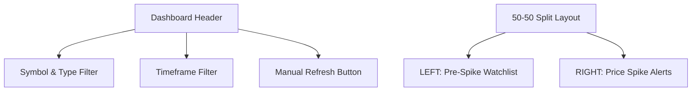

# UI Design Specification: US Market Price Spike & Pre-Spike Watchlist Dashboard

This document details the high-fidelity UI design specification for porting the **SpikeIQ Cinematic Glassmorphism Dashboard** to the US Market. It provides the exact design system values, layout structure, component mapping, and state requirements necessary to build an identical premium trading-terminal interface.

---

## 1. Core Visual Identity & Design System

The dashboard adopts a **Cinematic Glassmorphism** theme, utilizing high-end dark backgrounds, translucent panels with back-drop filters, and specialized typography for legibility and aesthetic elegance.

### 1.1 Color Palette (CSS Variable Tokens)
```css
:root {
  color-scheme: dark;
  --bg-primary: transparent;
  
  /* Background radial glow scene */
  --bg-scene: radial-gradient(ellipse 80% 60% at 30% 70%, #1a0a00, #0a0a0a, #000510);
  
  /* Glassmorphism panels */
  --bg-card: rgba(255, 255, 255, 0.04);
  --bg-card-hover: rgba(255, 255, 255, 0.07);
  --bg-input: rgba(255, 255, 255, 0.03);
  --bg-glass: rgba(255, 255, 255, 0.04);
  
  /* Typography colors */
  --text-primary: #e8e6e3;
  --text-secondary: #8a8780;
  --text-muted: #5a5750;
  
  /* Brand Accent */
  --accent-primary: #c8b89a; /* Warm Champagne Gold */
  
  /* Status & Action Colors */
  --green: #22e87a;
  --green-bg: rgba(34, 232, 122, 0.15);
  --red: #f56551;
  --red-bg: rgba(245, 101, 81, 0.15);
  --orange: #f59e42;
  --orange-bg: rgba(245, 158, 66, 0.15);
  --blue: #3b82f6;
  --blue-bg: rgba(59, 130, 246, 0.15);
  
  --border-color: rgba(255, 255, 255, 0.08);
  
  /* Glass Panel Specs */
  --glass-blur: blur(20px);
  --glass-border: 1px solid rgba(255, 255, 255, 0.08);
  --glass-radius: 16px;
  
  /* Animations */
  --transition: all 0.2s ease;
}
```

### 1.2 Typography
* **Headings & UI Labels:** `Syne` (weights: `500`, `600`, `700`, `800`) - Gives a modern, premium, geometric tech look.
* **Monospace Numeric Data:** `DM Mono` (weights: `400`, `500`) - Ensures clean tabular numbers (prices, time, changes) and exact vertical alignment.

### 1.3 Ambient Scene Enhancements
1. **Background Noise Film:** A fixed noise layer overlaying the `#root` at `opacity: 0.04` to create texture.
2. **Ambient Glowing Orbs:** Background pseudo-elements for soft radial accents:
   * Left-bottom: Warm Amber glow (`rgba(245,158,66,0.07)`).
   * Right-top: Slate Blue glow (`rgba(30,60,120,0.06)`).
3. **Trading Floor Grid Overlay:** A subtle background grid with a `60px` cell size using `linear-gradient` borders at `rgba(255, 255, 255, 0.025)`.

---

## 2. Dashboard Layout & Architecture

The page layout consists of a top control header and a side-by-side tables configuration.



### 2.1 Top Control Header
A horizontal control bar containing the title and filtering mechanisms:
* **Page Title:** `PRE-SPIKE WATCHLIST DASHBOARD` (1.25rem, `Syne`, bold, all caps).
* **Symbol Dropdown:** Single select dropdown displaying US tickers (`ALL`, `SPX`, `/ES`, `/NQ`, `TSLA`, `AAPL`, `NVDA`, `MSFT`, etc.).
* **Asset Type Selector:** Grouped buttons (`ALL`, `FUTURES`, `INDEX`, `STOCK`).
* **Timeframe Selector:** Grouped buttons (`15m`, `30m`, `45m`, `60m`, `Day`, `All`).
* **Refresh Action:** Ghost style button holding a `RefreshCw` icon with a custom spin animation during loading state.

### 2.2 Split Table Grid
A `grid-template-columns: 1fr 1fr` layout with a `20px` gap containing two independent Glassmorphic cards.

---

## 3. Component Details (Left Panel) - Pre-Spike Watchlist

This panel watches for unusual activity *before* the formal spike or breakout occurs.

### 3.1 Table Header
* **Title:** `PRE-SPIKE WATCH LIST` with an active amber/red blinking status indicator dot.
* **Max Height:** `480px` (with auto overflow scroll).

### 3.2 Columns & Data Mappings (US Market)
| Column | Width Alignment | Font | Format / Style | Example |
| :--- | :--- | :--- | :--- | :--- |
| **Time** | Center | `DM Mono` | `HH:MM:SS` (EST timezone / America/New_York) | `09:45:12` |
| **Symbol** | Left | `Syne` (Bold) | US Market ticker (Stock, Future, Index) | `TSLA`, `/ES` |
| **Price** | Right | `DM Mono` | USD Format with `$` prefix and 2 decimal points | `$241.50` |
| **Signal Type** | Left | `Syne` | Level badge with border | `FUTURES LEAD`, `STOCK WATCH` |
| **Setup** | Left | `Syne` | Description of the setup (Muted) | `Bullish Order Flow` |
| **Status** | Center | `Syne` | Colored badge with custom status icons | `WATCH` (Blue), `EARLY` (Amber) |

### 3.3 Visual Badges Styling (Left)
* **Futures Lead Badge:**
  * Background: `rgba(34, 232, 122, 0.1)` | Color: `#10b981` | Border: `1px solid rgba(34, 232, 122, 0.3)`
* **Stock Watch Badge:**
  * Background: `rgba(245, 158, 11, 0.1)` | Color: `#f59e0b` | Border: `1px solid rgba(245, 158, 11, 0.3)`
* **Index Watch Badge:**
  * Background: `rgba(59, 130, 246, 0.1)` | Color: `#3b82f6` | Border: `1px solid rgba(59, 130, 246, 0.3)`
* **Alert Status:**
  * `HOT`: Red Flame icon & label (`#ff4d4d`)
  * `WATCH`: Blue Zap icon & label (`#3b82f6`)
  * `EARLY`: Amber Glasses icon & label (`#f59e0b`)

---

## 4. Component Details (Right Panel) - Price Spike Alerts

This panel captures active momentum breakouts happening in real time.

### 4.1 Table Header
* **Title:** `PRICE SPIKE ALERTS` with an active blue pulse indicator dot.
* **Filter Tabs:** Tab buttons aligned right for action filters (`ALL`, `BUY`, `STRONG BUY`, `SELL`, `STRONG SELL`, `HOLD`).

### 4.2 Columns & Data Mappings (US Market)
| Column | Width Alignment | Font | Format / Style | Example |
| :--- | :--- | :--- | :--- | :--- |
| **Time** | Center | `DM Mono` | `HH:MM:SS` (EST timezone / America/New_York) | `10:14:05` |
| **Symbol** | Left | `Syne` (Bold) | US Market ticker (Stock, Future, Index) | `NVDA`, `/NQ` |
| **Price** | Right | `DM Mono` | USD Format with `$` prefix and 2 decimal points | `$125.80` |
| **Action** | Left | `Syne` | Alert Action badge | `STRONG BUY`, `SELL` |
| **Quality** | Center | `Syne` (Bold) | Quality classification badge | `A+`, `A`, `B` |
| **Setup** | Left | `Syne` | Brief trigger condition description | `1.5M Vol Spike` |

### 4.3 Visual Badges Styling (Right)
* **Action Badges:**
  * `STRONG BUY`: Background: `rgba(16,185,129,0.15)` | Color: `#10b981` | Border: `1px solid rgba(16,185,129,0.35)`
  * `BUY`: Background: `rgba(16,185,129,0.08)` | Color: `#10b981`
  * `STRONG SELL`: Background: `rgba(239,68,68,0.15)` | Color: `#ef4444` | Border: `1px solid rgba(239,68,68,0.35)`
  * `SELL`: Background: `rgba(239,68,68,0.08)` | Color: `#ef4444`
* **Quality Badges:**
  * `A+`: Gold colored badge (`rgba(245,158,11,0.12)`, `#f59e0b` text, translucent border)
  * `A`: Green colored badge (`rgba(16,185,129,0.1)`, `#10b981` text)
  * `B`: Blue colored badge (`rgba(59,130,246,0.1)`, `#3b82f6` text)

---

## 5. Interaction & Dynamic Features

1. **Skeleton Loading Rows:**
   * Both tables render smooth horizontal shimmers when filters are changed or pagination triggers an API call.
   * Uses linear gradients animating from `rgba(255, 255, 255, 0.05)` to `rgba(255, 255, 255, 0.12)`.
2. **Server-Side Pagination:**
   * Rows dropdown per table (`5`, `10`, `15`, `25`, `50` rows).
   * Left-bottom displays total matching rows.
   * Right-bottom displays `Current Page / Max Pages` with Previous/Next buttons.
3. **Silent Auto-Refreshing:**
   * Background refetching runs every **5 seconds** to keep tables fresh without triggering full-screen loading spinners.
   * A manual refresh triggers a toaster message and full shimmer.
4. **Time Zone Alignment:**
   * Date formatting helper uses `Intl.DateTimeFormat` with `timeZone: 'America/New_York'` to represent timestamps correctly in EST/EDT.
5. **Symbol Classifier:**
   * Automates the detection of US tickers starting with `/` as `FUTURES`, names containing major indices (like `SPX`, `NDX`) as `INDEX`, and other standard tickers as `STOCK`.
